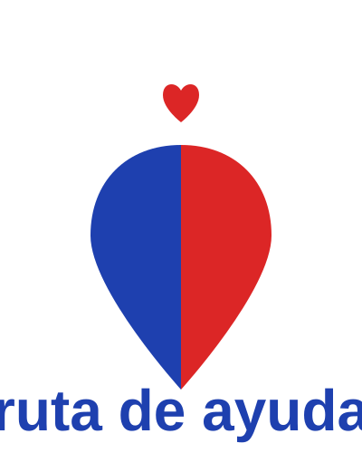
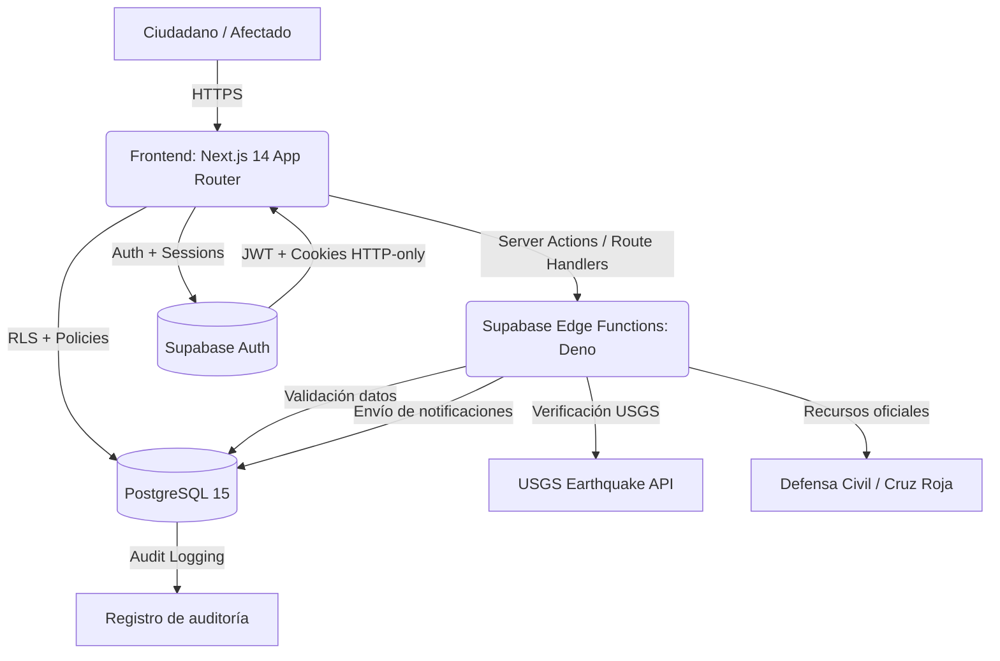

<div align="center">



# 🆘 RutaDeAyuda

**Plataforma centralizada de ayuda humanitaria para Colombia tras el terremoto del 10 de agosto de 2026**

[](https://nextjs.org/)
[](https://www.typescriptlang.org/)
[](https://tailwindcss.com/)
[](https://supabase.com/)
[](https://postgresql.org/)
[](https://vitest.dev/)
[](https://playwright.dev/)
[](https://opensource.org/licenses/MIT)
[](#)

Sistema de gestión de personas afectadas, centros de acopio, albergues y verificación de información para la emergencia por el terremoto del 10 de agosto de 2026 (Magnitud 7.4, San José del Palmar, Chocó).

</div>

---

## Pitch y propuesta de valor

**RutaDeAyuda** es una plataforma multiplataforma diseñada para centralizar y facilitar la ayuda humanitaria en Colombia tras el terremoto del **10 de agosto de 2026**.

El sistema permite a afectados y familiares consultar la disponibilidad de albergues en tiempo real, localizar centros de acopio cercanos, registrar personas desaparecidas, verificar información antes de compartirla y acceder a datos sismológicos oficiales. Los voluntarios y coordinadores cuentan con herramientas para gestionar recursos, actualizar estados y coordinar la ayuda de manera eficiente.

Transforma la respuesta a emergencias reemplazando procesos manuales y fragmentados por procedimientos automatizados que mejoran la organización, reducen la desinformación y aumentan la eficiencia en la entrega de ayuda a quienes más la necesitan.

---

## Arquitectura del sistema



---

## Stack tecnológico

### Frontend

- **Framework:** Next.js 14.2+ (App Router, Server Components, Streaming)
- **Lenguaje:** TypeScript 5.5 (`strict: true`)
- **Estilos:** Tailwind CSS 3.4 + shadcn/ui (componentes Radix)
- **Mapas:** Leaflet + OpenStreetMap
- **Iconografía:** `lucide-react` (sin emojis, SVG)

### Backend

- **Base de datos:** PostgreSQL 15 (Supabase) con RLS habilitado
- **Auth:** Supabase Auth (JWT + HTTP-only cookies)
- **Funciones serverless:** Supabase Edge Functions (Deno)
- **Validación:** Zod (esquemas compartidos cliente/servidor)
- **Email:** Resend (notificaciones)
- **Datos sismológicos:** USGS Earthquake API

### Testing y calidad

- **Unit/Integration:** Vitest + `@vitest/coverage-v8`
- **E2E:** Playwright (chromium, firefox, webkit)

---

## Módulos funcionales

| # | Módulo | Descripción | Funcionalidades |
|---|--------|-------------|-----------------|
| M1 | Personas Desaparecidas | Registro y búsqueda de afectados | Registro con foto, búsqueda por nombre/ubicación, estado de búsqueda |
| M2 | Centros de Acopio | Ubicación de centros de ayuda | Mapa interactivo, necesidades actuales, contacto directo |
| M3 | Albergues / Refugios | Hospedaje temporal para afectados | Badges disponibilidad (Verde/Amarillo/Azul), capacidad, registro |
| M4 | Centro de Verificación | Validación de información | Verificación antes de publicar, prevención desinformación |
| M5 | Datos USGS | Información sismológica en tiempo real | Sismogramas, réplicas, información de seguridad |
| M6 | Emergencia | Servicios de emergencia | Directorio telefónico, procedimientos, enlaces oficiales |

---

## Estructura del repositorio

```
rutadeayuda/
|
+- src/
|   +- app/                      # Next.js 14 (App Router)
|       +- (auth)/               # Autenticación
|       +- personas/             # Módulo personas desaparecidas
|       +- centros/              # Módulo centros de acopio
|       +- albergues/           # Módulo albergues
|       +- verificar/            # Centro de verificación
|       +- info/                 # Información general
|       +- api/                  # API Routes
|   +- components/
|       +- ui/                   # shadcn/ui components
|       +- layout/               # Header, footer, layouts
|   +- lib/
|       +- supabase/             # client.ts, server.ts, middleware.ts
|       +- security/             # rate-limit, validation, audit-log
|       +- email/                # Email sending
|       +- utils.ts              # Helpers
|   +- types/                    # TypeScript types
|
+- supabase/
|   +- migrations/               # SQL migrations
|   +- functions/               # Edge Functions Deno
|
+- docs/
|   +- ARCHITECTURE.md          # Diagramas y arquitectura
|   +- SECURITY.md              # Políticas de seguridad
|   +- OWASP-TOP10.md           # Checklist OWASP
|   +- CLAUDE.md                # Convenciones del proyecto
|
+- public/                      # Assets estáticos
```

---

## Seguridad

Este proyecto sigue las guías **OWASP Top 10** para garantizar la protección de datos sensibles.

### Medidas implementadas

| Medida | Descripción |
|--------|-------------|
| Helmet.js | Headers de seguridad HTTP |
| Zod | Validación y sanitización de inputs |
| RLS | Row Level Security en PostgreSQL |
| Rate Limiting | Limitación de solicitudes por IP |
| Audit Logging | Registro de acciones sensibles |
| CSP Headers | Content Security Policy |

Documentación detallada en [`docs/SECURITY.md`](./docs/SECURITY.md) y [`docs/OWASP-TOP10.md`](./docs/OWASP-TOP10.md).

---

## Equipo

<div align="center">

**Equipo Voluntario Ciudadano**

Desarrollo y mantenimiento

</div>

---

## Créditos

Este proyecto es **MIT** y está destinado exclusivamente a **uso humanitario**.

Para más información, consulta la [documentación completa](./docs/).

---

<div align="center">

**Desarrollado con ❤️ para Colombia**

🆘 RutaDeAyuda — Uniendo fuerzas cuando más se necesita

**Sistema desarrollado para la emergencia del terremoto — Agosto 2026**

</div>
